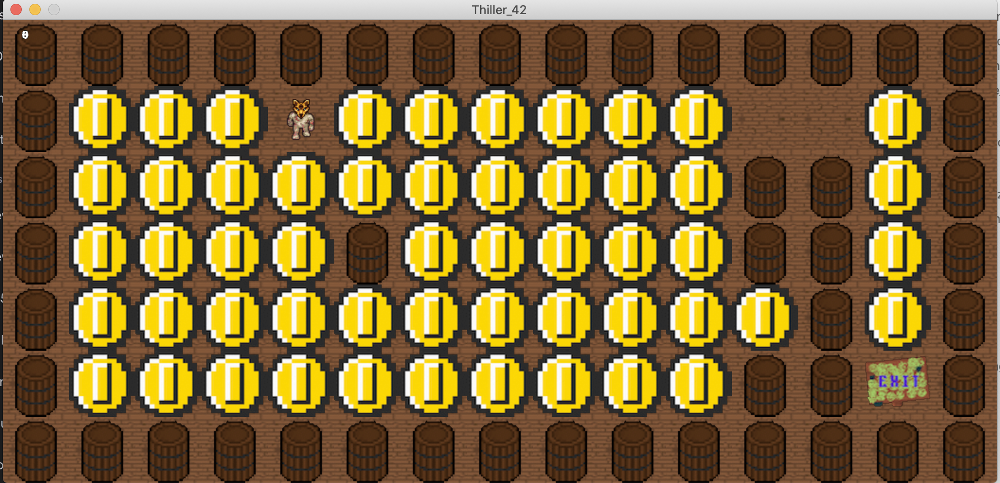

# So_Long



So_Long is a 2D maze game. In the game, the player navigates through a maze, collects coins while avoiding obstacles. The goal is to collect all the coins and reach the exit.

## Features

- Maze navigation.
- Coin collection and scoring.
- Exiting the maze to complete the game.
- Simple and user-friendly interface.


## Requirements

- C compiler
- MinilibX library

## How to Play

1. Compile the game by running the following command:

   ```bash
   make
   make bonus

2. After the compilation is complete, start the game by using the following command:
    ```bash
	./so_long maps/map.ber

Replace maps/map.ber with the file path of the maze map you want to play.

3. While playing the game, you can move the player using the arrow keys on your keyboard. Your objective is to collect all the coins and reach the exit.

4. After completing the game, you will see your score and a success message on the screen.

5. test.sh and test_bonus.sh can test your so_long game with diffrent maps
   command:
    ```bash
	./test.sh
	./test_bonus.sh

## Resources

- [MinilibX Documentation](https://harm-smits.github.io/42docs/libs/minilibx)
- [MinilibX Documentation](https://gontjarow.github.io/MiniLibX/)

## Contributing

For any bug reports or improvement suggestions, please open an Issue or submit a Pull Request.

## License

This project is licensed under the MIT License.
